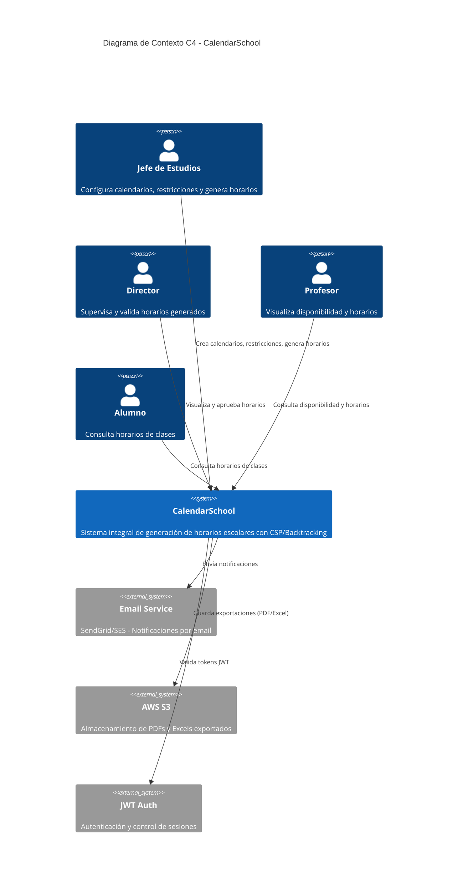
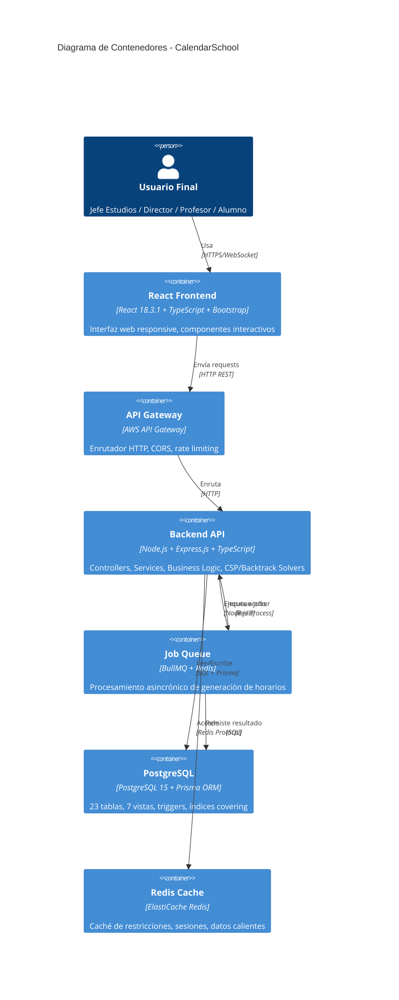
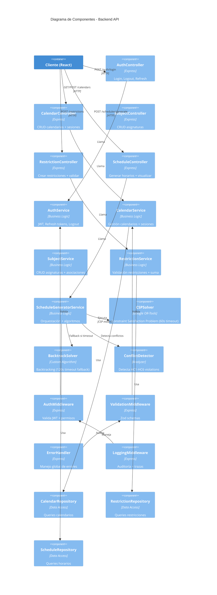
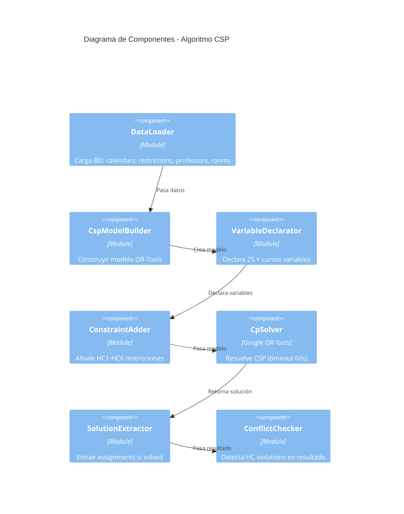

# Diagrama C4 - CalendarSchool Architecture

## Nivel 1: Contexto del Sistema

---

## Nivel 2: Contenedores

---

## Nivel 3: Componentes (Backend)

---

## Nivel 3: Base de Datos

```mermaid
C4Component
    title Diagrama de Componentes - PostgreSQL

    Component(users_table, "users", "Tabla", "id, email, password, role, status")
    Component(roles_table, "roles", "Tabla", "id, name, permissions JSON")
    Component(refresh_tokens_table, "refresh_tokens", "Tabla", "id, userId, tokenHash, isRevoked, expiresAt")

    Component(calendars_table, "calendars", "Tabla", "id, name, startDate, endDate, status")
    Component(sessions_table, "sessions", "Tabla", "id, calendarId, sessionNumber, startTime, endTime, isBreak")

    Component(subjects_table, "subjects", "Tabla", "id, name, type (CORE/ELECTIVE), status")
    Component(subject_courses_table, "subject_courses", "M:M", "subjectId, courseId")

    Component(restrictions_table, "restrictions", "Tabla", "id, type, subjectId, courseId, params JSON, status")
    Component(restriction_audit_table, "restriction_audit_trail", "Tabla", "id, restrictionId, changedAt, changedBy, beforeValue, afterValue")

    Component(schedules_table, "schedules", "Tabla", "id, calendarId, status, algorithm, generatedBy, solvedAt")
    Component(schedule_entries_table, "schedule_entries", "Tabla", "id, scheduleId, courseId, dayOfWeek, sessionNumber, subjectId, professorId, roomId")
    Component(generation_jobs_table, "schedule_generation_jobs", "Tabla", "id, calendarId, status, progress, result JSON")

    Component(view_professor_overlap, "schedule_conflicts_professor_overlap", "Vista", "HC2: Detecta profesor en 2 aulas simultaneas")
    Component(view_availability, "schedule_conflicts_availability", "Vista", "HC3: Fuera de disponibilidad")
    Component(view_professor_load, "professor_load_summary", "Vista", "Carga horaria por profesor")

    Component(idx_single_location, "IX_professor_session", "Índice Covering", "profesorId, dayOfWeek, sessionNumber + subjectId, roomId")
    Component(idx_calendar_status, "IX_calendar_status", "Índice", "calendarId, status, createdAt DESC")
    Component(idx_restriction_course, "IX_restriction_course", "Índice", "courseId, status + type, params")

    Rel(users_table, roles_table, "FK role", "")
    Rel(refresh_tokens_table, users_table, "FK userId", "")

    Rel(sessions_table, calendars_table, "FK calendarId", "")
    Rel(subject_courses_table, subjects_table, "FK subjectId", "")

    Rel(restrictions_table, subjects_table, "FK subjectId", "")
    Rel(restriction_audit_table, restrictions_table, "FK restrictionId", "")

    Rel(schedule_entries_table, schedules_table, "FK scheduleId", "")
    Rel(generation_jobs_table, calendars_table, "FK calendarId", "")

    Rel(view_professor_overlap, schedule_entries_table, "SELECT FROM", "")
    Rel(view_availability, schedule_entries_table, "SELECT FROM", "")
    Rel(view_professor_load, schedule_entries_table, "SELECT FROM AGGREGATE", "")

    Rel(idx_single_location, schedule_entries_table, "Indexa", "")
    Rel(idx_calendar_status, schedules_table, "Indexa", "")
    Rel(idx_restriction_course, restrictions_table, "Indexa", "")
```

---

## Nivel 3: Flujo de Algoritmo CSP

---

## Leyenda

| Símbolo | Significado |
|---------|------------|
| **Contenedor (C4)** | Sistema independiente (frontend, backend, BD) |
| **Componente** | Unidad de código dentro de contenedor |
| **Flujo** | Comunicación entre elementos |
| **M:M** | Relación Many-to-Many |
| **FK** | Foreign Key (Relación BD) |
| **Índice Covering** | Índice que incluye todas columnas (sin acceso tabla) |
| **Vista** | Consulta guardada en BD para reportes |

---

## Notas Arquitectónicas

### Decisiones Clave

1. **Separación de Capas**: Frontend (React) ↔ API Gateway ↔ Backend (Lambda) ↔ PostgreSQL
   - Ventaja: Independencia, escalabilidad, reutilización

2. **Algoritmo CSP + Backtrack**:
   - CSP (Google OR-Tools): Búsqueda rápida, solución óptima
   - Backtrack: Fallback determinístico si timeout CSP

3. **Job Queue (BullMQ + Redis)**:
   - Generación asincrónica (no bloquea API)
   - Reintentos automáticos, persistencia

4. **Índices Covering**:
   - HC2 (SINGLE_LOCATION): `(profesorId, dayOfWeek, sessionNumber)` → <20ms
   - Calendar search: `(calendarId, status, createdAt DESC)` → <50ms

5. **Soft Delete**:
   - Profesores, materias, calendarios marcados con `deletedAt`
   - GDPR compliance, auditoría no destructiva

### Flujos Principales

**Crear Calendario** → POST /calendars → CalendarService → INSERT calendars + sessions (trigger) → audit_logs

**Generar Horario** → POST /schedules/generate → BullMQ.enqueue → Lambda Worker → CSP Solver (60s) → Persist + Conflict Detection → UPDATE schedules

**Buscar Restricciones** → GET /restrictions → RestrictionRepository → Caché Redis → <100ms

---