## Índice

0. [Ficha del proyecto](#0-ficha-del-proyecto)
1. [Descripción general del producto](#1-descripción-general-del-producto)
2. [Arquitectura del sistema](#2-arquitectura-del-sistema)
3. [Modelo de datos](#3-modelo-de-datos)
4. [Especificación de la API](#4-especificación-de-la-api)
5. [Historias de usuario](#5-historias-de-usuario)
6. [Tickets de trabajo](#6-tickets-de-trabajo)
7. [Pull requests](#7-pull-requests)

---

<br>

## 0. Ficha del proyecto

### **0.1. Tu nombre completo:**

Enrique Reaño Fazio

### **0.2. Nombre del proyecto:**

CalendarSchool

### **0.3. Descripción breve del proyecto:**

**CalendarSchool** es un sistema integral de gestión de horarios escolares que automatiza la creación, validación y asignación de calendarios académicos, restricciones de carga horaria, y generación de horarios optimizados para centros educativos. Resuelve la compleja tarea de generar horarios respetando múltiples restricciones (disponibilidad de profesores, ubicación física única, carga horaria equilibrada) mediante algoritmos de optimización (CSP/Backtracking) y proporciona herramientas de auditoría y cumplimiento normativo (GDPR).

**Stack tecnológico:**
- **Backend:** Node.js + TypeScript + Express.js
- **Frontend:** React 18.3.1 + TypeScript + Bootstrap 5.3.3
- **Base de Datos:** PostgreSQL + Prisma ORM
- **Testing:** Jest + Supertest + Playwright 
- **Deployment:** AWS Lambda + Serverless Framework

**Usuarios objetivo:** Jefe de Estudios, Directores, Profesores, Alumnos  
**Alcance MVP:** 240+ casos de uso (7 historias de usuario principales)


### **0.4. URL del proyecto:**

PENDIENTE DE REALIZAR

### 0.5. URL o archivo comprimido del repositorio

https://github.com/kiketon007/CalendarSchool

---

<br>

## 1. Descripción general del producto

### **1.1. Objetivo:**

**Automatizar la generación de horarios escolares** eliminando el proceso manual que consume 20-40 horas semanales de trabajo administrativo en centros educativos. CalendarSchool proporciona:

- **Generación optimizada de horarios:** Algoritmos CSP (Constraint Satisfaction Problem) y Backtracking que respetan todas las restricciones académicas
- **Validación de restricciones críticas:** Garantiza que profesores no estén en 2 aulas simultáneamente (SINGLE_LOCATION), carga horaria equilibrada, disponibilidad de profesores
- **Auditoría y cumplimiento normativo:** Trazabilidad completa de cambios, soft delete GDPR-compliant, control de sesiones con revocación de tokens JWT
- **Gestión centralizada:** Dashboard único para configurar calendarios, asignaturas, restricciones y revisar horarios generados

**Para quién:** Jefes de Estudios, Directores, Coordinadores de Horarios que necesitan generar horarios fiables en horas (vs días o semanas manualmente)

**Valor aportado:**
- Ahorro de 20-40 horas/semana en trabajo manual
- Reducción de errores de planificación (0 conflictos HC-validados)
- Flexibilidad: cambios rápidos en restricciones → regeneración automática
- Cumplimiento normativo: auditoría completa, GDPR, control de acceso

### **1.2. Características y funcionalidades principales:**

#### **Módulo 1: Autenticación y Control de Acceso (US01-US03)**
- ✅ Autenticación JWT con refresh tokens persistentes
- ✅ Revocación de tokens por logout, cambio de contraseña, o logout forzado por admin
- ✅ Roles: Jefe de Estudios, Director, Profesor, Alumno
- ✅ Auditoría de sesiones (IP, user-agent, timestamps)

#### **Módulo 2: Gestión de Calendarios Base (US-BASE)**
- ✅ Configuración de calendario escolar (fecha inicio/fin, jornada horaria)
- ✅ Auto-generación de sesiones (1-8 por día, configurable)
- ✅ Soporte para recreos/breaks
- ✅ Validación: no solapamientos, máximo 90 min/sesión
- ✅ Edición post-uso con notificaciones de impacto

#### **Módulo 3: Gestión de Materias (US-SUBJECT)**
- ✅ CRUD de asignaturas (CORE, ELECTIVE, CUSTOM)
- ✅ Asociación N:M a cursos (una materia en múltiples cursos)
- ✅ Cascada automática: cambio en materia → regenerar horarios
- ✅ Soporte para soft delete GDPR

#### **Módulo 4: Restricciones de Carga Horaria (US19)**
- ✅ 4 tipos de restricciones: HOURS_PER_WEEK, AVAILABILITY, NO_DUPLICATE, SINGLE_LOCATION
- ✅ Validación CRÍTICA SINGLE_LOCATION: profesor no en 2 aulas mismo día/sesión
- ✅ Configuración bulk por grupo (matriz editable con todas asignaturas)
- ✅ Avisos dinámicos (ej: suma > 25 franjas)
- ✅ Cascada: cambio restricción → marca horarios NEEDS_REVIEW

#### **Módulo 5: Visualización de Restricciones (US20)**
- ✅ Listado filtrable de restricciones activas (tipo, curso, status)
- ✅ Búsqueda case-insensitive sin acentos (US11)
- ✅ Barra visual de disponibilidad con código de colores
- ✅ Hover con desglose de restricciones
- ✅ Responsive: desktop, tablet, móvil

#### **Módulo 6: Disponibilidad de Profesores (US-PROF-AVAIL)**
- ✅ Grid visual: Lun-Vie × Sesiones (marcar disponible/no disponible)
- ✅ Botones conveniencia: Marcar Todo, Solo Mañana, Solo Tarde, Inversión
- ✅ Display: franjas disponibles + barra visual %
- ✅ Validación: no más de X sesiones simultáneas

#### **Módulo 7: Asignación de Asignaturas (US-PROF-ASSIGN)**
- ✅ Profesor + Asignatura + Cursos + Sesiones/Semana
- ✅ Cálculo dinámico: cursos × sesiones = total sesiones
- ✅ Validaciones: no duplicados, no mismatch restricción, disponibilidad suficiente
- ✅ Avisos permitidos (sobrecarga) → horarios marked NEEDS_REVIEW

#### **Módulo 8: Resumen de Carga (US-PROF-SUMMARY)**
- ✅ Tabla maestro: Profesor | Asignaturas | Total Sesiones | Disponibilidad | Estado
- ✅ Indicador color: 🟢 OK (0-75%), 🟡 Aviso (75-100%), 🔴 Error (>100%)
- ✅ Expandible: detalles, timeline, advertencias
- ✅ Acciones rápidas: editar disponibilidad/asignaciones
- ✅ Exportar CSV

#### **Módulo 9: Generación de Horarios (US-ALGO - Futuro)**
- ✅ Algoritmo CSP/Backtracking configurable
- ✅ Job queue con progreso en tiempo real
- ✅ 7 vistas de detección automática de conflictos:
  - professor_overlap (profesor en 2 aulas)
  - no_room (asignación sin aula)
  - availability (fuera de disponibilidad)
  - professor_load (carga horaria)
  - professor_availability_summary (% disponible)
  - restriction_audit_trail (auditoría restricciones)
- ✅ Descarga horarios (PDF, Excel)

#### **Seguridad & Auditoría**
- ✅ Control JWT con refresh tokens revocables
- ✅ Auditoría completa: createdBy/updatedBy en 7 tablas
- ✅ Soft delete GDPR: deletedAt en profesores, materias, calendarios
- ✅ Validaciones Hard Constraints (HC1-HC6) en schema
- ✅ Triggers automáticos: marcar conflictos en cambios
- ✅ Índices optimizados: búsqueda case-insensitive, performance O(log n)

### **1.3. Diseño y experiencia de usuario:**

PENDIENTE

### **1.4. Instrucciones de instalación:**

PENDIENTE

---

## 2. Arquitectura del Sistema

### **2.1. Diagrama de arquitectura:**
**Patrón**: Aplicación de tipo monolito modular (separación de backend y frontend a nivel de estructura de carpetas) con arquitectura en capas (Layered Architecture).

CalendarSchool sigue una **arquitectura de 4 capas** (Presentación → Aplicación → Datos → Infraestructura) que permite separación clara de responsabilidades, escalabilidad independiente y fácil testing. Se ha elegido esta arquitectura porque:
1. **Separación de responsabilidades**: Frontend (React), Backend (Express), BD (PostgreSQL + ORM Prisma) evolucionan independientemente.
La separación en 4 capas aplica el principio de responsabilidad única. La capa de Aplicación coordina los casos de uso sin conocer la interfaz de usuario ni los detalles de persistencia. La capa de Datos/Dominio define la estructura y reglas de negocio principales, mientras que la Infraestructura gestiona la integración externa y el acceso a datos.
2. **DX (Developer Experience) y velocidad de desarrollo**: Tener backend y frontend organizados en la misma estructura de carpetas facilita la gestión del proyecto sin la sobrecarga operativa de gestionar múltiples repositorios o tuberías CI/CD complejas. Además, al compartir tipos TypeScript (a través de esquemas o bibliotecas compartidas) entre ambas partes, se reducen drásticamente los errores en tiempo de ejecución al consumirse las API internas.
3. **Productividad con Prisma ORM**: Prisma encaja de manera natural en la capa de Infraestructura:
    * Trazabilidad de tipos: Genera tipos TypeScript de forma automática a partir del esquema de la base de datos (schema.prisma), garantizando seguridad de tipos end-to-end.
    * Aislamiento: La capa de Aplicación o Datos invoca repositorios o interfaces abstractas, evitando que la lógica de negocio dependa directamente del cliente de Prisma.
    * Migraciones declarativas: Simplifica la evolución de la base de datos e integración continua.


**Beneficios**:
  * Testeo unitario fácil (mock services).
  * Cohesión técnica y simplicidad de versión: Un único repositorio o estructura de carpetas facilita la revisión de código, la refactorización global y el seguimiento de cambios compartidos entre frontend y backend.
  * Despliegue unificado o modular: Permite desplegar la aplicación como una sola unidad executable o, si fuera necesario, empaquetar e implementar el frontend (e.g. estáticos/SSR) y el backend por separado en el futuro.
  * Bajo coste de infraestructura inicial: Evita la latencia de red entre servicios, la orquestación compleja de contenedores (Kubernetes/Service Mesh) y la gestión de trazas distribuidas.
  * Tipado de extremo a extremo: Compartir contratos de API y modelos entre capas reduce inconsistencias entre lo que el frontend solicita y lo que el backend devuelve.
  * Evolución progresiva: Si un módulo específico requiere escalar de forma independiente en el futuro, su aislamiento por capas facilita extraerlo a un microservicio sin reescribir todo el sistema.

**Sacrificios**:
  * Latencia de red entre capas (~50-100ms).
  * Tiempos de compilación e integración: A medida que la base de código crece, las ejecuciones de tests y los pipelines de CI/CD para todo el monolito pueden volverse más lentos comparados con repositorios independientes.
  * Overhead de ORM Prisma vs raw SQL.
  * Escalado horizontal uniforme: Si una función específica (ej. procesamiento de imágenes) consume muchos recursos, no es posible escalarla individualmente sin escalar la instancia completa de la aplicación.

**Para más información consultar @docs/arquitectura/ARQUITECTURA_COMPLETA.md Y @docs/arquitectura/DIAGRAMA_C4.md**

---

### **2.2. Descripción de componentes principales:**

| Componente | Tecnología | Responsabilidad |
|------------|-----------|-----------------|
| **Frontend** | React 18.3.1 + TypeScript + Bootstrap 5.3.3 | UI responsive para gestión calendarios, restricciones, visualización horarios |
| **API Gateway** | AWS API Gateway | Enrutamiento HTTP/REST, CORS, rate limiting (100 req/min), validación headers |
| **Backend API** | Node.js + Express.js + TypeScript | 5 Controllers (Auth, Calendar, Subject, Restriction, Schedule), 5 Services, 5 Repositories, 5 Middleware |
| **Job Queue** | BullMQ (Redis) | Procesamiento asincrónico: GenerationJob (60s CSP + 120s fallback Backtrack), CleanupJob (cron diario), NotificationJob (emails) |
| **Database** | PostgreSQL 15 + Prisma ORM | 23 tablas (autenticación, calendarios, restricciones, horarios), 7 vistas SQL (HC detection), 15+ índices covering, 6 triggers (auditoría) |
| **Optimización** | Google OR-Tools + Custom Backtrack | CSP Solver (60s timeout) resuelve restricciones HC1-HC6, fallback Backtracking (120s) si timeout |
| **Cache** | AWS ElastiCache (Redis Cluster) | Caché restricciones, sesiones, datos calientes (TTL 5min) |
| **Storage** | AWS S3 | Almacenamiento PDFs/Excels exportados (signed URLs 24h) |

---

### **2.3. Descripción de alto nivel del proyecto y estructura de ficheros**

**Estructura propuesta** (patrón Clean Architecture + Modular Monolith):

```
calendarschool/
├── frontend/                      # React 18 (Vite)
│   ├── e2e/                      # Pruebas End-to-End (E2E) con Playwright
│   │   ├── fixtures/             # Datos estáticos y helpers para tests E2E
│   │   │   └── auth.fixture.ts
│   │   ├── specs/                # Test suites de flujos completos de usuario
│   │   │   ├── auth-register.spec.ts    # E2E de registro (US01 + reCAPTCHA fallback)
│   │   │   ├── courses-management.spec.ts # E2E de gestión de cursos y tutores (US05)
│   │   │   └── professors-crud.spec.ts  # E2E de gestión de profesores (US09)
│   │   └── utils/                # Utilidades E2E (selectores dinámicos, mocks de API)
│   ├── src/
│   │   ├── __mocks__/            # Mocks globales de Jest (ej. Google reCAPTCHA, SDKs)
│   │   │   └── recaptchaMock.ts
│   │   ├── components/           # Componentes reutilizables
│   │   │   ├── AuthRegisterForm.tsx
│   │   │   └── __tests__/        # Pruebas unitarias/integración de componentes con Jest + RTL
│   │   │       ├── AuthRegisterForm.test.tsx  # Cobertura US01 (errores inline, cookies, botón loading)
│   │   │       └── CreateCourseForm.test.tsx  # Cobertura US05 (unicidad, selección de tutor)
│   │   ├── pages/                # Páginas (Dashboard, Calendar, Schedule)
│   │   ├── services/             # API client (axios)
│   │   │   └── __tests__/        # Pruebas de integración de servicios API (Jest + MSW/Mocks)
│   │   │       └── authService.test.ts
│   │   ├── store/                # Redux state management
│   │   ├── styles/               # Bootstrap customization
│   │   └── setupTests.ts         # Configuración global de Jest (@testing-library/jest-dom)
│   │
│   ├── jest.config.ts            # Configuración de Jest (environment: 'jsdom', transformadores ts-jest)
│   ├── playwright.config.ts      # Configuración de Playwright (browsers, base_url, timeouts)
│   └── package.json
│
├── backend/                       # Node.js + Express
│   ├── src/
│   │   ├── controllers/          # HTTP handlers (CalendarController.ts, etc)
│   │   ├── services/             # Business logic (CalendarService, ScheduleGeneratorService)
│   │   ├── repositories/         # Data access (Prisma abstractions)
│   │   ├── middleware/           # Auth, Validation, Logging, ErrorHandler
│   │   ├── algorithms/           # CSPSolver, BacktrackSolver, ConflictDetector
│   │   ├── models/               # DTO/Zod schemas
│   │   ├── workers/              # BullMQ job handlers
│   │   └── config/               # Database, Redis, AWS configs
│   ├── prisma/
│   │   ├── schema.prisma         # ORM schema (23 tablas, FK, indices)
│   │   └── migrations/           # DB versioning
│   ├── tests/                     # Jest + Supertest
│   └── package.json
│
├── docs/                          # Documentación
│   ├── arquitectura/
│   │   ├── ARQUITECTURA_COMPLETA.md
│   │   ├── DIAGRAMA_C4.md
│   │   └── ARQUITECTURA_C4_STRUCTURIZR.dsl
│   ├── Modelo_de_Datos/
│   │   ├── MODELO_DATOS.md
│   │   └── MODELO_DATOS_SQL_DDAL.sql
│   └── User_Stories_MVP.md
│
└── infrastructure/                # IaC (Serverless Framework)
    ├── serverless.yml             # Lambda, API Gateway, RDS, ElastiCache, S3
    └── lambda-layers/             # OR-Tools library, dependencies

```

**Patrón aplicado**: Clean Architecture (separación interfaces ↔ casos uso ↔ lógica ↔ BD) + DDD Aggregates (RestrictionAggregate, ScheduleAggregate) + Repository Pattern (ICalendarRepository → PrismaCalendarRepository).

---


### **2.4. Infraestructura y despliegue**

**Infraestructura AWS**:
- **API Layer**: API Gateway → Lambda (Node.js 18, 1024 MB, timeout 900s)
- **Data Layer**: RDS Aurora PostgreSQL (Multi-AZ, backups automáticos diarios, read replicas)
- **Cache**: Pendiente de realización cuando la aplicación este mas madura
- **Storage**: S3 (PDFs/Excels exportados con signed URLs)
- **Monitoring**: Pendiente de realización cuando la aplicación este mas madura

**Proceso de despliegue** (Serverless Framework + GitHub Actions):
1. Developer hace push a main → GitHub Actions trigger
2. Build: `npm run build` (TypeScript compilation, bundling)
3. Test: Jest + Supertest (unit + integration) + Playwright (E2E en staging)
4. Deploy: `serverless deploy --stage prod` → Lambda + RDS migrations + CloudFront invalidation
5. Rollback: Git tag + `serverless deploy -f arn:aws:lambda:...` si error

**Diagrama**:
```
┌─────────────┐    ┌──────────┐    ┌─────────────┐    ┌────────────┐
│   GitHub    │───→│  Actions │───→│  Serverless │───→│  AWS      │
│   (Main)    │    │  (Build) │    │  (Deploy)   │    │  (Live)   │
└─────────────┘    └──────────┘    └─────────────┘    └────────────┘
```


---

### **2.5. Seguridad**

1. **Autenticación & Autorización**:
   - JWT access token (15 min) + refresh token (7 días, persistent + revocable)
   - Refresh tokens almacenados como hash bcrypt en BD (no token crudo)
   - RBAC: 4 roles (jefe_estudios, director, profesor, alumno) con permisos JSON
   - Logout seguro: `UPDATE refresh_tokens SET isRevoked=TRUE` (no delete)

2. **Validación de Entrada**:
   - Schemas Zod en middleware (validación frontend + backend)
   - Parametrized queries Prisma ORM previene SQL injection
   - Sanitización HTML con DOMPurify (previene XSS)
   - Rate limiting: 100 req/min por IP (previene brute-force)

3. **Datos Sensibles**:
   - Contraseñas: Bcrypt cost factor 12 (salted hashing)
   - Soft delete GDPR: `deletedAt` timestamp (no eliminación física)
   - Audit trail: createdBy/updatedBy en 7 tablas + restriction_audit_trail

4. **Comunicación**:
   - HTTPS TLS 1.3 (API Gateway enforce)
   - CORS restringido a dominios conocidos
   - X-Frame-Options, CSP headers (previene clickjacking)

5. **Monitoreo**:
   - CloudWatch alerts: error rate > 5%, latency P95 > 2s, failed auth attempts > 10
   - X-Ray tracing distribuido (end-to-end request tracking)
   - Logs centralizados con createdBy/ipAddress para auditoría de seguridad

<br>

### **2.6. Tests**

> PENDIENTE

---

<br>

## 3. Modelo de Datos

### **3.1. Diagrama del modelo de datos:**

```mermaid
erDiagram
    %% ========== MÓDULO 1: AUTENTICACIÓN ==========
    ROLES ||--o{ USER_ROLES : has
    USERS ||--o{ USER_ROLES : has
    USERS ||--o{ REFRESH_TOKENS : generates
    USERS ||--o{ COURSES : creates
    USERS ||--o{ SUBJECTS : creates
    USERS ||--o{ RESTRICTIONS : creates
    USERS ||--o{ SCHEDULES : generates

    %% ========== MÓDULO 2: CURSOS Y CLASES ==========
    COURSES ||--o{ CLASSES : contains
    COURSES ||--o{ SUBJECT_COURSES : has
    ROOMS ||--o{ SCHEDULE_ENTRIES : occupies
    CLASSES ||--o{ STUDENTS : groups

    %% ========== MÓDULO 3: PROFESORES ==========
    PROFESSORS ||--o{ PROFESSOR_SUBJECTS : teaches
    PROFESSORS ||--o{ PROFESSOR_AVAILABILITIES : hasAvailability
    PROFESSORS ||--o{ CLASSES : tutors
    PROFESSORS ||--o{ SCHEDULE_ENTRIES : assigned

    %% ========== MÓDULO 4: CONFIGURACIÓN HORARIOS ==========
    SUBJECTS ||--o{ SUBJECT_COURSES : "belongsTo"
    SUBJECTS ||--o{ PROFESSOR_SUBJECTS : "taughtBy"
    SUBJECTS ||--o{ RESTRICTIONS : specifies
    SUBJECTS ||--o{ SCHEDULE_ENTRIES : "scheduledAs"
    CALENDARS ||--o{ SESSIONS : generates
    CALENDARS ||--o{ SCHEDULES : "basedOn"
    CALENDARS ||--o{ RESTRICTIONS : "constrains"

    %% ========== MÓDULO 5: RESTRICCIONES ==========
    RESTRICTIONS ||--o{ RESTRICTION_AUDIT_TRAIL : "audits"

    %% ========== MÓDULO 6: HORARIOS GENERADOS ==========
    SCHEDULES ||--o{ SCHEDULE_ENTRIES : contains
    SCHEDULES ||--o{ SCHEDULE_GENERATION_JOBS : "generatedBy"
    CLASSES ||--o{ SCHEDULE_ENTRIES : "has"
    STUDENTS ||--o{ STUDENT_SCHEDULES : "takes"
    SCHEDULES ||--o{ STUDENT_SCHEDULES : "includes"

    %% ========== ENTIDADES ==========

    ROLES {
        int id PK
        string name UK
        text description
        json permissions
        timestamp createdAt
    }

    USERS {
        int id PK
        string email UK
        string password
        string firstName
        string lastName
        boolean verified
        enum role "jefe_estudios|director|profesor|alumno"
        enum status "ACTIVE|INACTIVE|SUSPENDED"
        timestamp createdAt
        timestamp updatedAt
    }

    USER_ROLES {
        int id PK
        int userId FK
        int roleId FK
        timestamp assignedAt
        unique uk_userId_roleId
    }

    REFRESH_TOKENS {
        int id PK
        int userId FK
        string tokenHash UK
        boolean isRevoked
        timestamp expiresAt
        text userAgent
        string ipAddress
        timestamp createdAt
    }

    COURSES {
        int id PK
        string name
        string code UK
        string level
        int academicYear
        enum status "ACTIVE|ARCHIVED"
        int createdBy FK
        int updatedBy FK
        timestamp createdAt
        timestamp updatedAt
    }

    ROOMS {
        int id PK
        string name UK
        int capacity
        string type
        int floor
        enum status "ACTIVE|MAINTENANCE"
        timestamp createdAt
        timestamp updatedAt
    }

    CLASSES {
        int id PK
        int courseId FK
        string name
        int tutorId FK "NOT NULL"
        timestamp createdAt
        timestamp updatedAt
        unique uk_courseId_name
        unique uk_tutorId
    }

    PROFESSORS {
        int id PK
        string email
        string firstName
        string lastName
        int classId FK
        enum status "ACTIVE|INACTIVE|ON_LEAVE|RETIRED"
        timestamp deletedAt "soft-delete"
        timestamp createdAt
        timestamp updatedAt
    }

    SUBJECTS {
        int id PK
        string name
        string code UK
        enum type "CORE|ELECTIVE|CUSTOM"
        text description
        enum status "ACTIVE|INACTIVE"
        timestamp deletedAt "soft-delete"
        int createdBy FK
        int updatedBy FK
        timestamp createdAt
        timestamp updatedAt
    }

    PROFESSOR_SUBJECTS {
        int id PK
        int professorId FK
        int subjectId FK
        timestamp createdAt
        unique uk_professorId_subjectId
    }

    PROFESSOR_AVAILABILITIES {
        int id PK
        int professorId FK
        int dayOfWeek "1-5 (Mon-Fri)"
        int sessionNumber "1-8"
        boolean isAvailable
        timestamp createdAt
        timestamp updatedAt
        unique uk_profesorId_day_session
    }

    CALENDARS {
        int id PK
        string name
        text description
        date startDate
        date endDate
        enum status "DRAFT|ACTIVE|ARCHIVED"
        int createdBy FK
        int updatedBy FK
        timestamp createdAt
        timestamp updatedAt
        timestamp deletedAt "soft-delete"
    }

    SESSIONS {
        int id PK
        int calendarId FK
        int sessionNumber "1-8"
        time startTime
        time endTime
        int duration
        boolean isBreak
        timestamp createdAt
    }

    SUBJECT_COURSES {
        int id PK
        int subjectId FK
        int courseId FK
        timestamp createdAt
        unique uk_subjectId_courseId
    }

    RESTRICTIONS {
        int id PK
        enum type "HOURS_PER_WEEK|AVAILABILITY|NO_DUPLICATE|SINGLE_LOCATION"
        int subjectId FK
        int courseId FK
        int calendarId FK
        json params "sessionsPerWeek|maxPerDay"
        enum status "ACTIVE|INACTIVE"
        int createdBy FK
        int updatedBy FK
        timestamp createdAt
        timestamp updatedAt
    }

    RESTRICTION_AUDIT_TRAIL {
        int id PK
        int restrictionId FK
        timestamp changedAt
        int changedBy FK
        string action
        json beforeValue
        json afterValue
    }

    SCHEDULES {
        int id PK
        int calendarId FK
        enum status "DRAFT|GENERATING|SOLVED|NEEDS_REVIEW|FAILED"
        enum algorithm "CSP|BACKTRACK"
        int generatedBy FK
        timestamp solvedAt
        timestamp completedAt
        json metadata
        timestamp createdAt
        timestamp updatedAt
    }

    SCHEDULE_ENTRIES {
        int id PK
        int scheduleId FK
        int classId FK
        int dayOfWeek "MON-FRI"
        int sessionNumber "1-8"
        int subjectId FK
        int professorId FK
        int roomId FK
        enum status "ASSIGNED|CONFLICT_PENDING|MANUALLY_ADJUSTED"
        int createdBy FK
        int updatedBy FK
        timestamp createdAt
        timestamp updatedAt
    }

    SCHEDULE_GENERATION_JOBS {
        int id PK
        int calendarId FK
        enum status "QUEUED|PROCESSING|COMPLETED|FAILED|TIMEOUT"
        int progress "0-100"
        json result
        text error
        timestamp startedAt
        timestamp completedAt
        timestamp createdAt
    }

    STUDENTS {
        int id PK
        string email
        string firstName
        string lastName
        int classId FK
        enum status "ACTIVE|INACTIVE|GRADUATED"
        timestamp createdAt
        timestamp updatedAt
    }

    STUDENT_SCHEDULES {
        int id PK
        int studentId FK
        int scheduleId FK
        timestamp enrolledAt
        unique uk_studentId_scheduleId
    }
```



---

<br>

## **3.2. Descripción de entidades principales**

### **1. USERS (Usuarios del Sistema)**
- **PK:** `id` (INT AUTO_INCREMENT)
- **Atributos clave:** `email` (UNIQUE, NOT NULL), `password` (hash bcrypt), `firstName`, `lastName`, `role` (ENUM: jefe_estudios|director|profesor|alumno), `status` (ENUM: ACTIVE|INACTIVE|SUSPENDED), `verified` (BOOLEAN)
- **Relaciones:** M:1 con ROLES (vía USER_ROLES), 1:M con REFRESH_TOKENS, 1:M con COURSES (creador), 1:M con SUBJECTS (creador)
- **Restricciones:** Email UNIQUE, firstName/lastName NOT NULL, CHECK longitud > 0
- **Índices:** PK, UNIQUE email, IX (role, status), Full-text (firstName, lastName)

### **2. CALENDARS (Calendarios Base)**
- **PK:** `id`
- **Atributos clave:** `name`, `startDate`, `endDate`, `status` (ENUM: DRAFT|ACTIVE|ARCHIVED), `deletedAt` (soft-delete)
- **Relaciones:** 1:M con SESSIONS (auto-generadas), 1:M con SCHEDULES (base para generación), 1:M con RESTRICTIONS (FK)
- **Restricciones:** `createdBy`/`updatedBy` FK → users (auditoría GDPR)
- **Índices:** PK, IX (status, createdAt DESC)

### **3. SESSIONS (Sesiones Horarias)**
- **PK:** `id`
- **Atributos clave:** `sessionNumber` (1-8), `startTime`, `endTime`, `duration` (INT minutos), `isBreak` (BOOLEAN para recreos)
- **Relaciones:** M:1 con CALENDARS (FK calendarId)
- **Restricciones:** UNIQUE (calendarId, sessionNumber), duration ≤ 90 min, no solapamientos (CHECK)
- **Índices:** PK, IX (calendarId, sessionNumber)

### **4. SUBJECTS (Materias/Asignaturas)**
- **PK:** `id`
- **Atributos clave:** `name`, `code` (UNIQUE), `type` (ENUM: CORE|ELECTIVE|CUSTOM), `status` (ACTIVE|INACTIVE), `deletedAt` (soft-delete)
- **Relaciones:** M:M con COURSES (vía SUBJECT_COURSES), M:M con PROFESSORS (vía PROFESSOR_SUBJECTS), 1:M con RESTRICTIONS (especificadas)
- **Restricciones:** `createdBy`/`updatedBy` FK → users (auditoría), cascada delete a RESTRICTIONS
- **Índices:** PK, UNIQUE code, IX (type, status, deletedAt)

### **5. PROFESSORS (Profesores)**
- **PK:** `id`
- **Atributos clave:** `firstName`, `lastName`, `email`, `status` (ENUM: ACTIVE|INACTIVE|ON_LEAVE|RETIRED), `deletedAt` (soft-delete GDPR)
- **Relaciones:** M:M con SUBJECTS (vía PROFESSOR_SUBJECTS), 1:M con PROFESSOR_AVAILABILITIES (matriz L-V × 8 sesiones), 1:1 con CLASSES (tutorId)
- **Restricciones:** UNIQUE (classId) para tutores, FK profesorId en SCHEDULE_ENTRIES → SET NULL (no CASCADE), auditoría (createdAt/updatedAt)
- **Índices:** PK, IX (firstName, lastName, status, deletedAt), **IX COLLATE utf8mb4_general_ci** (búsqueda case-insensitive US11), Full-text

### **6. RESTRICTIONS (Restricciones de Carga Horaria)**
- **PK:** `id`
- **Atributos clave:** `type` (ENUM: HOURS_PER_WEEK|AVAILABILITY|NO_DUPLICATE|SINGLE_LOCATION), `params` (JSON: {sessionsPerWeek: 1-8, maxPerDay: 1-3}), `status` (ACTIVE|INACTIVE)
- **Relaciones:** M:1 con SUBJECTS, M:1 con COURSES, M:1 con CALENDARS (FK MEJORA #1), 1:M con RESTRICTION_AUDIT_TRAIL
- **Restricciones:** UNIQUE (type, subjectId, courseId, calendarId), NOT NULL params, CHECK sesionsPerWeek ≤ 8, trigger marca SCHEDULES como NEEDS_REVIEW si cambia
- **Índices:** PK, IX (courseId, status), IX (subjectId, type), UNIQUE restriction key

### **7. SCHEDULES (Horarios Generados)**
- **PK:** `id`
- **Atributos clave:** `status` (ENUM: DRAFT|GENERATING|SOLVED|NEEDS_REVIEW|FAILED), `algorithm` (ENUM: CSP|BACKTRACK), `generatedBy` (FK users), `solvedAt`, `metadata` (JSON: {conflicts: [...], duration_ms: N})
- **Relaciones:** M:1 con CALENDARS (base), 1:M con SCHEDULE_ENTRIES (asignaciones), M:1 con SCHEDULE_GENERATION_JOBS (tracking)
- **Restricciones:** `createdBy`/`updatedBy` (auditoría), FK generatedBy NOT NULL, status transition DRAFT → GENERATING → SOLVED/FAILED
- **Índices:** PK, IX (calendarId, status, createdAt DESC), IX (generatedBy, solvedAt)

### **8. SCHEDULE_ENTRIES (Asignaciones de Horario)**
- **PK:** `id`
- **Atributos clave:** `dayOfWeek` (1-5: Mon-Fri), `sessionNumber` (1-8), `status` (ENUM: ASSIGNED|CONFLICT_PENDING|MANUALLY_ADJUSTED)
- **Relaciones:** M:1 con SCHEDULES, M:1 con CLASSES, M:1 con SUBJECTS, M:1 con PROFESSORS (FK SET NULL), M:1 con ROOMS
- **Restricciones:** **HC2 CRITICAL** `UNIQUE (profesorId, dayOfWeek, sessionNumber)` detecta profesor en 2 aulas simultáneamente, FK FK professors → SET NULL (auditoría no-destructiva), `createdBy`/`updatedBy`
- **Índices:** PK, **IX COVERING (profesorId, dayOfWeek, sessionNumber) INCLUDE (subjectId, roomId)** (HC2 <20ms), IX (scheduleId, classId), IX (status)

### **9. PROFESSOR_AVAILABILITIES (Matriz de Disponibilidad)**
- **PK:** `id`
- **Atributos clave:** `dayOfWeek` (1-5), `sessionNumber` (1-8), `isAvailable` (BOOLEAN: profesor disponible en ese slot)
- **Relaciones:** M:1 con PROFESSORS
- **Restricciones:** UNIQUE (profesorId, dayOfWeek, sessionNumber), NOT NULL isAvailable
- **Índices:** PK, UNIQUE constraint, IX (profesorId, dayOfWeek)

### **10. REFRESH_TOKENS (Control de Sesiones JWT)**
- **PK:** `id`
- **Atributos clave:** `tokenHash` (VARCHAR UNIQUE - hash del token, NO token crudo), `isRevoked` (BOOLEAN: marca logout/cambio-password), `expiresAt`, `userAgent`, `ipAddress` (auditoría seguridad)
- **Relaciones:** M:1 con USERS
- **Restricciones:** `expiresAt` NOT NULL, `isRevoked` DEFAULT FALSE, TokenHash UNIQUE para validación rápida
- **Índices:** PK, UNIQUE tokenHash, IX (userId, expiresAt DESC) para limpieza automática, IX (isRevoked)

---

<br>

## 4. Especificación de la API

> PENDIENTE
---

<br>

## 5. Historias de Usuario

>### US01: Registro de usuario con email y contraseña

**Épica:** [1. Autenticación y Gestión de Sesiones](#epica-1-autenticacion-y-gestion-de-sesiones)

**Historia:**
Como visitante no autenticado, quiero crear una cuenta con mi nombre, email y contraseña, para acceder a CalendarSchool, asegurar la privacidad de mis credenciales y comenzar la gestión de los datos de mi colegio.

#### Casos de uso y reglas de negocio

* **Gestión de tráfico y Brute Force:**
  * Rate limiting por IP/Fingerprint (máximo 5 intentos de registro por cada 15 minutos). Si se supera, se devuelve HTTP `429 Too Many Requests`.

* **Protección Anti-bot (Google reCAPTCHA v3):**
  * Integración transparente en frontend. Score umbral: `≥ 0.6`.

* **Fallback:** Si el score es `< 0.6`, presentar de forma interactiva un reto **reCAPTCHA v2 / Challenge** explícito al usuario en lugar de reintentar en bucle en backend.

* **Flujos de resiliencia de navegador:**
  * Re-registración con email usado: Flujo amigable sin fuga de información (ver sección *Seguridad*).
  * Manejo de registro tras crash/cierre de navegador: Conservación de datos de formulario mediante `sessionStorage` (excepto la contraseña) hasta que el usuario complete el proceso.
  * Compatibilidad con cookies deshabilitadas: Mensaje inline notificando que se requieren cookies para mantener la sesión activa.
  * Múltiples pestañas/navegadores simultáneos: Bloqueo de solicitudes duplicadas concurrentes mediante token de formulario único por sesión.

* **Control de Timeout:** Timeout de la petición HTTP configurado a 10 segundos en backend.
* **Feedback Visual e Inline:**
  * Los mensajes de error de validación se muestran inline, justo debajo de cada campo correspondiente (nombre, apellidos, email, contraseña).

* **Almacenamiento seguro de credenciales:**
  * Algoritmo **Bcrypt con Cost Factor 12** (o salting dinámico/workers según carga de CPU).
  * Normalización obligatoria: Emails siempre almacenados en **minúsculas** (`toLowerCase()`) y con eliminación de espacios al inicio/final (`trim()`).

* **Gestión de Sesiones y Tokens:**
  * **Cookie de Sesión / Refresh Token:** Configurada con `HttpOnly`, `Secure` y `SameSite=Lax` (para permitir la navegación entrante desde emails) con **TTL de 24 horas**.
  * **Access Token (JWT en memoria):** **TTL de 15 minutos**.

* **Estatus de la Cuenta:**
  * La cuenta se crea en estado `EMAIL_PENDING`. Se permite el acceso al Onboarding (US04), pero se envía en paralelo un correo de confirmación de email (TTL 24h) requerido para acciones críticas.


#### Restricciones de campos y formatos

##### 1. Nombre y Apellidos (campos separados)

* **Caracteres permitidos:** A-Z, a-z, 0-9, acentos (á, é, í, ó, ú, ñ, Á, É, Í, Ó, Ú, Ñ), espacios, guiones y apóstrofos.
* **Límite:** 100 caracteres por campo.
* **Ejemplos permitidos:**
* Nombre: `"José María"` ✓
* Apellidos: `"García-López"` ✓


##### 2. Email (RFC 5321 SMTP Compliance)

* **Longitud máxima:** 320 caracteres totales.
* **Regex de validación:**
```regex
^[a-zA-Z0-9.!#$%&'*+/=?^_`{|}~-]+@[a-zA-Z0-9](?:[a-zA-Z0-9-]{0,61}[a-zA-Z0-9])?(?:\.[a-zA-Z0-9](?:[a-zA-Z0-9-]{0,61}[a-zA-Z0-9])?)+$
```

* **Formatos Aceptados:**
* `usuario+tag@dominio.com` ✓
* `usuario@sub-dominio.com` ✓
* `usuario@dominio.co.uk` ✓

* **Formatos Rechazados:**
* `usuario@localhost` ✗
* `usuario@192.168.1.1` ✗
* `usuario@` ✗


##### 3. Contraseña (Estandarizada para Registro y Reset)

* **Longitud:** Mínimo **8 caracteres**, máximo **128 caracteres** *(corregido el límite inferior de 12)*.
* **Variedad requerida:** Al menos una letra mayúscula, una minúscula, un número y un carácter especial/símbolo (`!@#$%^&*()_+-=[]{}|;:,.<>?`).


#### Criterios de Aceptación (MVP)

* **CA1 (Registro exitoso y Onboarding):** Dado que estoy en la pantalla de registro, cuando ingreso un email válido, un nombre, apellidos y una contraseña válida de entre 8 y 128 caracteres, entonces se crea la cuenta, se almacena el email en minúsculas sanitizado, se inicia la sesión mediante cookie segura y soy redirigido automáticamente a la pantalla de bienvenida (US04 - Onboarding).
* **CA2 (Error de longitud de contraseña):** Dado que intento registrarme con una contraseña fuera del rango permitido (menos de 8 caracteres o más de 128), cuando intento enviar el formulario, veo un error inline "La contraseña debe tener entre 8 y 128 caracteres" y el formulario no se envía.
* **CA3 (Manejo de Email existente y Privacidad):** Dado que intento registrarme con un email que ya existe en el sistema, cuando envío el formulario, el sistema muestra un mensaje claro indicando "Este email ya está registrado" con un enlace hacia la pantalla de login, o bien envía una notificación por correo redirigiendo al usuario a la pantalla de acceso.
* **CA4 (Formato de email inválido):** Dado que ingreso un email con sintaxis inválida (sin `@`, dominio incompleto, caracteres prohibidos o dirección IP), cuando envío el formulario, veo un error inline "Formato de email inválido" y el formulario no se envía.
* **CA5 (Fallos de Captcha y Reto Anti-bot):** Dado que un intento de registro obtiene un score de reCAPTCHA v3 menor a 0.6, el sistema solicita completar un reto visual secundario (reCAPTCHA v2 Checkbox) para verificar que soy un usuario humano antes de procesar el registro.


#### Requisitos Técnicos, QA y Riesgos

##### Requisitos de Testing (Pre-release)

* **Unit Tests:** Validaciones de Regex de email, longitud/reglas de contraseña, sanitización `trim()`/`toLowerCase()` y generadores de hashing.
* **E2E Tests (Playwright):** Flujo completo de Registro -> Redirección a Onboarding -> Recuperación de contraseña.
* **Tests de Seguridad:** Inyección SQL, XSS en campos de texto, validación de políticas CORS, ataques de fijación de sesión y bypass CSRF.
* **Tests de Rendimiento:** Prueba de carga de **1000 registros simultáneos** garantizando que la CPU no sufra *starvation* debido a los cálculos de Bcrypt (mediana de respuesta `< 800ms`).
* **Tests de Accesibilidad:** Cumplimiento normativo **WCAG 2.1 AA** (foco en errores inline accesibles por lectores de pantalla via `aria-describedby` y `role="alert"`).

##### Riesgos y Mitigaciones

* **Seguridad:**
* **Cookies:** Flag `HttpOnly` activado, flag `Secure` activado, propiedad `SameSite=Lax`.
* **Protección XSS/SQLi:** Uso estricto de ORM/consultas preparadas y escape de variables HTML en frontend.
* **Prevención de Enumeración:** Respuestas genéricas en el formulario de *Forgot Password*.

* **Observabilidad (Auditoría de Logs):**
* Registrar eventos estructurados: `USER_REGISTER_SUCCESS`, `USER_REGISTER_FAILED`, `PASSWORD_RESET_REQ`.
* **Payload del log:** `timestamp` + `email` + `ip` + `user_agent`.
* ✗

* **Internacionalización (i18n):**
* Extraer todos los mensajes de error y textos de interfaz a archivos de recursos JSON (`es.json`, `en.json`) para evitar textos estáticos (*hardcoded*).


---


>### US05: Crear un curso con clases y tutores

**Épica:** [2. Gestión de Cursos y Estructura Base](#epica-2-gestion-de-cursos-y-estructura-base)

**Historia:** Como jefe de estudios, quiero crear un curso (ej. "1º Primaria") con sus clases (A, B, etc.) y asignar un tutor a cada una, para estructurar la organización del colegio.


#### Casos de uso y reglas de negocio

* **Estructura de curso y clases:**
  * Curso = nivel educativo (ej. "1º Primaria", "Infantil 3 años", "6º Primaria").
  * Cada curso puede tener múltiples clases (A, B, C, etc.).
  * Cada clase requiere un tutor asignado.

* **Validación de nombres:**
  * Nombre de curso debe ser único (no se permite duplicar nombres de cursos).
  * Nombre de clase debe ser único DENTRO del mismo curso (no puede haber dos "A" en "1º Primaria").
  * Caracteres permitidos: alfanuméricos (A-Z, a-z, 0-9) + caracteres especiales (º, ª, -, espacio, etc.).
  * Ambos campos son obligatorios.

* **Gestión de tutores:**
  * Un tutor solo puede ser tutor de UNA clase (no puede tutorizar múltiples clases simultáneamente).
  * Tutor debe existir en BD como profesor del colegio y estar en estado ACTIVE.
  * Se muestra dropdown filtrable con lista de profesores disponibles (nombre + apellido).
  * Si no hay profesores disponibles, se muestra mensaje claro.

* **Protección de formulario:**
  * Botón "Guardar" se deshabilita tras primer clic (previene doble envío).
  * Si usuario intenta enviar dos veces rápidamente, solo se crea UN curso.

* **Sincronización y cascada:**
  * Si un profesor es borrado (US09 - Borrar profesor):
    * Se elimina automáticamente como tutor de la clase.
    * Se elimina de los horarios en los que esté asignado (US19).
    * Clase queda SIN tutor (requiere reasignar).

* **Manejo de errores:**
  * Errores de validación se muestran inline debajo del campo correspondiente.
  * Errores del servidor se muestran con mensaje claro, sin tecnicismos.
  * Si servidor falla: "No se pudo crear el curso. Intenta de nuevo".


#### Restricciones de campos y formatos

##### Nombre de Curso
* **Carácter obligatorio**: Sí.
* **Caracteres permitidos**: Alfanuméricos (A-Z, a-z, 0-9) + especiales (º, ª, -, /, espacio).
* **Límite**: 100 caracteres máximo.
* **Unicidad**: No puede haber dos cursos con mismo nombre.
* **Ejemplos válidos**: "1º Primaria", "Infantil 3 años", "6º Primaria", "2ª ESO".

##### Nombre de Clase
* **Carácter obligatorio**: Sí.
* **Caracteres permitidos**: Alfanuméricos (A-Z, a-z, 0-9) + especiales (º, ª).
* **Límite**: 10 caracteres máximo.
* **Unicidad**: Dentro del MISMO curso (no puede haber dos "A").
* **Ejemplos válidos**: "A", "B", "1ªA", "Grupo A".
* **Sin límite máximo**: Se pueden crear N clases por curso.

##### Tutor
* **Carácter obligatorio**: Sí, una clase sin tutor no puede crearse.
* **Validación**: Profesor debe existir en BD y estar ACTIVE.
* **Restricción crítica**: Un tutor solo puede estar asignado a UNA clase en todo el colegio.
* **Interfaz**: Dropdown filtrable por nombre/apellido con búsqueda en tiempo real.
* **Fallback**: Si no hay profesores disponibles, mostrar mensaje "No hay profesores disponibles. Crea profesores primero en Gestión de Profesores".


#### Criterios de Aceptación (Ampliados - 10 CAs)

* **CA1 (Crear curso exitoso):** Dado que estoy en la sección de gestión de cursos, cuando completo el formulario con nombre de nivel ("1º Primaria"), clases ("A", "B") y asigno tutores VÀLIDOS para cada clase, entonces el curso se crea exitosamente, aparece en el listado, y cada clase muestra el tutor asignado.

* **CA2 (Nombre de nivel obligatorio):** Dado que intento crear un curso sin indicar nombre de nivel, cuando intento enviar el formulario, entonces veo error inline "El nombre del nivel es obligatorio" y el formulario no se envía.

* **CA3 (Al menos una clase obligatoria):** Dado que intento crear un curso sin asignar al menos una clase, cuando intento enviar el formulario, entonces veo error "Debe indicar al menos una clase para el curso" y el formulario no se envía.

* **CA4 (Tutor válido requerido):** Dado que intento asignar un tutor inválido o no existente a una clase, cuando intento enviar el formulario, entonces veo error inline "Debe asignar un tutor válido a cada clase".

* **CA5 (Curso aparece en listado):** Dado que cree exitosamente un curso "1º Primaria" con clases A (tutor Juan) y B (tutor María), cuando veo el listado de cursos, entonces aparece "1º Primaria" con estructura: Clase A - Juan, Clase B - María.

* **CA6 (Nombre de curso es único):** Dado que intento crear un segundo curso con mismo nombre "1º Primaria", cuando intento enviar el formulario, entonces veo error "Este curso ya existe en el sistema. Usa otro nombre".

* **CA7 (Nombre de clase es único dentro del curso):** Dado que intento crear dos clases con mismo nombre ("A") en el mismo curso "1º Primaria", cuando intento enviar el formulario, entonces veo error "Ya existe una clase A en este curso".

* **CA8 (Un tutor en una sola clase):** Dado que asigno profesor "Juan" como tutor de clase A en "1º Primaria", cuando intento asignar "Juan" como tutor de otra clase en el mismo u otro curso, entonces veo error "Este profesor ya es tutor de otra clase. Elige otro profesor".

* **CA9 (Protección contra doble envío):** Dado que presiono "Guardar" dos veces rápidamente, cuando intento guardar, entonces botón "Guardar" se deshabilita tras primer clic, y solo se crea UN curso (no duplicados).

* **CA10 (Interfaz de selección de tutor y fallback):** Dado que intento asignar tutor a una clase, cuando hago clic en campo de tutor, entonces aparece dropdown filtrable con lista de profesores disponibles (nombre + apellido). Si no hay profesores disponibles, veo mensaje "No hay profesores disponibles. Crea profesores primero en Gestión de Profesores".

* **CA11 (Sincronización cascada - profesor borrado):** Dado que un profesor es borrado del sistema (US09), cuando se ejecuta eliminación, entonces ese profesor se remueve automáticamente como tutor de la clase, se elimina de los horarios donde estaba asignado (US19), y clase queda sin tutor (requiere reasignación).

* **CA12 (Manejo de errores server-side):** Dado que frontend valida OK pero backend falla (ej., profesor borrado simultáneamente), cuando intento guardar, entonces veo error claro "No se pudo crear el curso. Intenta de nuevo" (SIN mensajes técnicos).

* **CA13 (Caracteres especiales permitidos):** Dado que intento crear curso con nombre "1º Primaria", "Infantil 3 años", "6ª Primaria", cuando envío el formulario, entonces se acepta (alfanuméricos + º, ª, -, / permitidos).


#### Requisitos Técnicos, QA y Riesgos

##### Requisitos de Testing (Pre-release)

* **Unit Tests:** Validación de uniqueness (curso, clase), validación de tutor, restricción "un tutor por clase".
* **E2E Tests:** Crear curso completo ✗
* **Tests de Seguridad:** Prevención de doble envío, SQL injection en nombre de curso.
* **Tests de Cascada:** Borrar profesor ✗
* **Performance:** Búsqueda de tutores en dropdown con 1000+ profesores (búsqueda filtrada).

##### Riesgos y Mitigaciones

* **Integridad referencial:**
  * Un tutor asignado a clase NO puede ser eliminado de profesor (cascade delete en BD).
  * Si profesor es borrado, clase debe quedar sin tutor (permitir null en BD).
  * Horarios con ese profesor deben ser actualizados/eliminados (cascada).

* **Concurrencia:**
  * Si dos admin crean clase y asignan mismo tutor simultáneamente, segundo intento falla.
  * Validación en BD: UNIQUE constraint en (class_id, teacher_id).

* **Observabilidad (Auditoría de Logs):**
  * Registrar eventos: `COURSE_CREATED`, `CLASS_CREATED`, `TEACHER_ASSIGNED`.
  * **Payload del log**: timestamp + usuario + course_id + clase_ids + teacher_ids.
  * ✗

* **Internacionalización (i18n):**
  * Extraer mensajes de error a archivos JSON para multiidioma (futura expansión).


#### Dependencias

* **Depende de US09 (Crear profesor)**: Debe haber profesores disponibles para asignar como tutores.
* **Impacta en US19 (Generación de horarios)**: Horarios se crean basándose en profesores asignados a clases.
* **Impacta en US08 (Borrar curso)**: No se puede borrar curso con alumnos asignados.


---


>### US09: Crear un profesor

**Épica:** [3. Gestión de Profesores](#epica-3-gestion-de-profesores)

**Historia:** Como jefe de estudios o director, quiero crear un profesor indicando su nombre, apellido, múltiples asignaturas que puede impartir, y si es tutor de un curso, para configurar la estructura docente del colegio con flexibilidad para profesores que enseñan varias materias.
  

**Casos de uso y reglas de negocio:**
* **Acceso a creación:** Solo jefes de estudios y directores pueden crear profesores. Botón "Crear Profesor" está en listado de profesores (US10). Se abre formulario con campos: nombre, apellido, asignaturas (multiselect), tutor de clase (opcional).

* **Campos obligatorios:** Nombre (obligatorio), Apellido (obligatorio), Asignaturas (obligatorio - multiselect, mínimo 1, máximo N), Tutor de clase (opcional, profesor puede crearse sin clase asignada, tutor_id = NULL), Email (NO obligatorio, no se solicita en formulario de creación).

* **Validación de nombre y apellido:** Caracteres permitidos: alfanuméricos (A-Z, a-z, 0-9), acentos (á, é, í, ó, ú, ñ), guiones (-), apóstrofos ('), espacios. Límite: 100 caracteres por campo. No puede ser solo espacios (debe tener caracteres alfanuméricos). NO hay validación de unicidad: pueden existir múltiples profesores con mismo nombre + apellido.

* **Gestión de asignaturas:** Asignaturas: checkboxes multiselect. Mínimo 1 asignatura requerida (validación). Máximo: N asignaturas (sin límite explícito, pero práctico ~10). Solo se muestran asignaturas con status ACTIVE (de US-SUBJECT). Múltiples profesores pueden tener las MISMAS asignaturas (sin restricción de unicidad). Ejemplos: Prof. Smith [Inglés, Arts], Prof. García [Inglés, Valenciano], Prof. López [Educación Física].

* **Integración con US-SUBJECT:** Sistema pre-carga lista de asignaturas desde tabla subjects WHERE status = 'ACTIVE'. Cada asignatura muestra tipo (CORE/ELECTIVE/CUSTOM) como ayuda visual. Si no hay asignaturas disponibles, mostrar aviso "No hay asignaturas ACTIVE disponibles. Crear primero en US-SUBJECT".

* **Gestión de tutoría:** Tutor de clase es opcional. Un profesor puede ser tutor de UNA sola clase (restricción heredada de US05). Profesor se crea SIN tutor (tutor_id = NULL) y se asigna después si es necesario.

* **Estado del profesor:** Profesor se crea en estado ACTIVE automáticamente. No hay campo para cambiar estado al crear.

* **Permisos:** Solo jefes de estudios y directores pueden crear profesores. Profesores y alumnos NO ven el botón crear. Si intenta acceder vía API, recibe error 403 Forbidden.

* **Feedback post-creación:** Formulario se cierra. Listado de profesores se actualiza inmediatamente. Notificación de éxito: "Profesor creado correctamente" (toast/snackbar). Profesor aparece en listado con nombre, asignaturas (separadas por comas) y estado de tutoría.
  
<br>

**Criterios de Aceptación:**
* **CA1 (Crear profesor con 1 asignatura):** Dado que estoy en sección gestión de profesores, cuando completo formulario con nombre "José María", apellido "García López", selecciono asignatura "Inglés" (checkbox), marco "Sin tutor" (opcional), entonces profesor se crea exitosamente en estado ACTIVE con 1 asignatura.

* **CA2 (Crear profesor con múltiples asignaturas):** Dado que completo nombre "Smith", apellido "John", selecciono 3 asignaturas [✗

* **CA3 (Nombre y apellido obligatorios):** Dado que intento crear profesor sin nombre o sin apellido, cuando intento guardar, entonces veo error inline "Nombre y apellido son obligatorios" y formulario no se envía.

* **CA4 (Asignaturas obligatorio - mínimo 1):** Dado que no selecciono ninguna asignatura, cuando intento guardar, entonces veo error "Debe seleccionar al menos 1 asignatura" y formulario no se envía.

* **CA5 (Profesor aparece en listado con asignaturas):** Dado que cree exitosamente profesor "Smith, John" con asignaturas [Inglés, Arts] sin tutor, cuando veo listado de profesores, entonces aparece: "Smith, John | Inglés, Arts | Sin tutoría".

* **CA6 (Badge expandible de asignaturas en listado):** Dado que profesor tiene 3+ asignaturas, cuando veo badge "3 asignaturas" en listado, entonces puedo hacer clic para expandir y ver detalle: [Inglés, Arts, Matemáticas] (con tipo CORE/ELECTIVE/CUSTOM).

* **CA7 (Tutor en una sola clase - restricción):** Dado que intento asignar profesor como tutor de múltiples clases simultáneamente, cuando intento guardar, entonces veo error "Un profesor solo puede ser tutor de una clase" y formulario no se envía.

* **CA8 (Validar clase existe):** Dado que intento asignar profesor a clase que no existe, cuando intento guardar, entonces veo error "La clase seleccionada no existe" y formulario no se envía.

* **CA9 (Caracteres especiales permitidos):** Dado que creo profesor con nombre "José María García-López" o "D'Angelo MÀ¼ller", cuando guardo, entonces se acepta (acentos, guiones, apóstrofos permitidos).

* **CA10 (Nombre no solo espacios):** Dado que intento crear profesor con nombre "     " (solo espacios), cuando intento guardar, entonces veo error "El nombre debe contener caracteres alfanuméricos" y formulario no se envía.

* **CA11 (Permisos: solo jefe_estudios o director):** Dado que soy profesor (no jefe de estudios/director), cuando intento ver formulario crear profesor, entonces no veo el formulario, o si intento acceder vía API, recibo error 403 Forbidden.

* **CA12 (Validar asignaturas existen y ACTIVE):** Dado que intento enviar asignatura con ID que no existe o está INACTIVE, cuando guardo vía API, entonces recibo error "Una o más asignaturas no existen o no están activas" y no se crea profesor.

* **CA13 (Transacción atómica: profesor + asignaturas):** Dado que guardo profesor con 3 asignaturas, cuando se produce error en INSERT INTO professor_subjects, entonces toda transacción hace ROLLBACK (no se crea profesor ni asignaturas parciales).

* **CA14 (Mostrar solo asignaturas ACTIVE):** Dado que hay asignaturas con status INACTIVE en BD, cuando abro formulario, entonces checkbox lista solo muestra asignaturas con status = 'ACTIVE' (filtro automático).

<br>

**Requisitos Técnicos:**
* Frontend: Componentes CreateProfessorForm (nombre, apellido, asignaturas multiselect, tutor), SubjectsCheckboxList (checkboxes multiselect con tipo CORE/ELECTIVE/CUSTOM), ClassDropdown (clases sin tutor), NotificationToast (éxito/error). API: POST /api/professors (crear profesor).
* Backend: Ruta POST /api/professors con validación de permiso (jefe_estudios || director), firstName + lastName (obligatorio, 100 chars, caracteres válidos), subjectIds array (obligatorio, mínimo 1, máximo N), cada subjectId validar existe y status='ACTIVE', classId (opcional, debe existir, sin otro tutor). Transacción BD completa (INSERT professors + INSERT professor_subjects). Response: { professor: { id, firstName, lastName, subjectIds, subjects: [...], classId, status: 'ACTIVE' } }.
* BD: Tabla professors con id, firstName, lastName, specialty (nullable, DEPRECATED - backward compat), classId (nullable), status, created_at. Àndices en firstName, lastName, status. NUEVA TABLA: professor_subjects (id, profesorId FK✗

<br>

**Decisiones Tomadas:**
| Decisión | Justificación |
|----------|---------------|
| **Múltiples asignaturas** | Realidad: profesores enseñan varias materias (Smith: Inglés+Arts) |
| **Multiselect (checkboxes)** | Claro, visual, mejor UX que dropdown múltiple |
| **Mínimo 1 asignatura** | Profesor debe poder enseñar algo (validación en BD) |
| **Solo ACTIVE en dropdown** | No confundir con asignaturas inactivas |
| **Many-to-many professor_subjects** | Flexible, permite N asignaturas por profesor sin límite |
| **specialty DEPRECATED** | Backward compat: campo sigue existiendo pero no usado. Read prioriza professor_subjects. Write siempre a profesor_subjects. |
| **Migración Opción 2** | Deprecate completamente: migrar datos legacy specialty✗
| **Profesor sin clase al crear** | Tutor se asigna después en US05/US07, orden flexible |
| **NO validar unicidad nombre** | Múltiples profesores pueden compartir nombre |
| **Un tutor por clase** | Restricción heredada de US05 |
| **Permisos: jefe_estudios O director** | Ambos roles administran profesores |
| **Transacción atómica** | INSERT profesor + INSERT professor_subjects en una transacción, ROLLBACK si falla alguna |


---


## 6. Tickets de Trabajo


>### BE1 — Modelo de Datos y Migración (`users`) --> Corresponde a la US01

**Objetivo:** Diseñar e implementar la tabla `users` vía migración AdonisJS, sentando la base de datos para el registro.

**Responsabilidades consolidadas:**

1. **Modelo de datos (Migración AdonisJS)**
   - Tabla `users`: 
     - PK: `id` (uuid)
     - `firstName` (string, 100 chars, A-Z a-z 0-9 acentos espacios guiones apóstrofos)
     - `lastName` (string, 100 chars, mismos caracteres)
     - `email` (string, 320 chars máx, **unique constraint**, stored lowercase)
     - `passwordHash` (string, Bcrypt output)
     - `status` (enum: `EMAIL_PENDING`, `ACTIVE`, `SUSPENDED`, `DELETED`)
     - `createdAt`, `updatedAt` (timestamps)
   - Índice: `UNIQUE(email)`
   - Soft delete: `deletedAt` nullable

2. **Modelo ORM (AdonisJS Lucid)**
   - Crear modelo `User` con:
     - Relaciones (si hay; ej. hasMany `refresh_tokens`)
     - Métodos de validación o helpers si son reutilizables

**Flujo de la tarea:**
1. Crear migración de BD (tabla `users` con todos los campos y índices)
2. Crear modelo ORM `User` (AdonisJS Lucid)

---

<br>

>### BE2 — API de Registro (`POST /api/auth/register`)  --> Corresponde a la US01

**Objetivo:** Crear el endpoint REST que valida, hashea y persiste el usuario en la tabla `users` previamente creada.

**Responsabilidades consolidadas:**

1. **Endpoint REST**
   - Path: `POST /api/auth/register`
   - Request body:
     ```json
     {
       "firstName": "José",
       "lastName": "García-López",
       "email": "usuario@dominio.com",
       "password": "SecurePass123!",
       "reCaptchaToken": "token_from_v3_or_v2"
     }
     ```
   - Response (201 Created):
     ```json
     {
       "userId": "uuid",
       "accessToken": "jwt_15min",
       "refreshToken": "token_for_cookie"
     }
     ```
   - Error responses:
     - 400 (Bad Request): validación fallida → `{ errorCode, message }`
     - 409 (Conflict): email ya existe → `{ errorCode: "EMAIL_DUPLICATED", message }`
     - 429 (Too Many Requests): rate limit superado → `{ errorCode: "RATE_LIMITED" }`
     - 422 (Unprocessable Entity): captcha fallido → `{ errorCode: "CAPTCHA_FAILED" }`

2. **Validación de payload (Vine schema)**
   - **firstName**: obligatorio, 1-100 chars, regex: `^[A-Za-z0-9áéíóúñÁÉÍÓÚÑ\s\-']+$`
   - **lastName**: obligatorio, 1-100 chars, mismos caracteres
   - **email**: obligatorio, RFC 5321 regex, máx. 320 chars
     ```regex
     ^[a-zA-Z0-9.!#$%&'*+/=?^_`{|}~-]+@[a-zA-Z0-9](?:[a-zA-Z0-9-]{0,61}[a-zA-Z0-9])?(?:\.[a-zA-Z0-9](?:[a-zA-Z0-9-]{0,61}[a-zA-Z0-9])?)+$
     ```
   - **password**: obligatorio, 8-128 chars, debe contener: mayúscula + minúscula + número + símbolo (`!@#$%^&*()_+-=[]{}|;:,.<>?`)
   - **reCaptchaToken**: obligatorio (string no vacío)

3. **Hashing de contraseña**
   - Algoritmo: **Bcrypt** con cost factor 12 (o dinámico según carga CPU)
   - Librería: `bcrypt` o `argon2` (definir según stack base-standards.md)
   - Nunca almacenar contraseña en texto plano

4. **Manejo de email duplicado (Privacidad - CA3)**
   - Consulta: `SELECT COUNT(*) FROM users WHERE LOWER(email) = ? AND deletedAt IS NULL`
   - Si existe: respuesta amigable sin revelar duplicidad (no revelar si email registrado)
   - Ejemplo: `{ message: "Este email ya está registrado", action: "login_link" }`

5. **Timeout HTTP**
   - Configurar: **10 segundos** en el middleware de timeout del backend

**Flujo de la tarea:**
1. Crear schema de validación (Vine)
2. Crear controller `AuthController::register()`
3. Registrar ruta `POST /api/auth/register`
4. Implementar lógica de validación contra esquema
5. Implementar hashing de contraseña y persistencia
6. Implementar respuestas de error según códigos especificados
7. Verificar timeout HTTP 10s configurado

--- 

<br>
 
>### FE1 — Formulario de Registro e Integración reCAPTCHA --> Corresponde a la US01

**Objetivo:** Crear interfaz de registro con validación en tiempo real, reCAPTCHA v3+v2, y manejo de errores.

**Responsabilidades consolidadas:**

1. **Componente de Formulario**
   - Path: `src/components/AuthRegisterForm.tsx` (o .jsx)
   - Campos controlados (React state):
     - `firstName` (string)
     - `lastName` (string)
     - `email` (string)
     - `password` (string)
   - Botón "Registrarse" con estado `loading` (deshabilitado mientras se procesa)
   - Validación en tiempo real (on blur/change):
     - Mostrar errores inline bajo cada campo
     - Estilos: `aria-describedby` + `role="alert"` para accesibilidad
     - Mensajes dinámicos según error (email inválido, contraseña débil, etc.)

2. **Integración reCAPTCHA v3 + Fallback v2**
   - Librería: `@react-google-recaptcha/react` o similar
   - v3 (transparente, automático):
     - Script de Google en `<head>` o componente wrapper
     - Generar token en `handleSubmit()` automáticamente
     - Score retornado desde Google (no visible al usuario)
   - Fallback v2 (checkbox explícito):
     - Si v3 retorna score < 0.6, renderizar challenge v2
     - Usuario marca checkbox "No soy un robot"
     - Solo si v2 completado, proceder con envío

3. **Validación de Formulario (Espejo del Backend)**
   - Regex email RFC 5321 (JavaScript)
   - Reglas de contraseña: 8-128 chars, mayúscula+minúscula+número+símbolo
   - Mostrar indicador visual de fortaleza de contraseña (ej: barra roja/amarilla/verde)
   - Errores inline:
     - Email: "Formato de email inválido"
     - Contraseña: "La contraseña debe tener entre 8 y 128 caracteres"
     - Contraseña débil: "La contraseña debe contener mayúscula, minúscula, número y símbolo"

4. **Bloqueo de Envíos Duplicados (CSRF + Idempotencia)**
   - Generar token único por sesión: `sessionStorage.setItem('formToken', uuid())`
   - Incluir en cada envío: `{ ..., _token: formToken }`
   - Backend valida: si mismo token en < 1 segundo, rechazar 400
   - Frontend desabilita botón mientras se procesa (no permitir re-envío)

5. **Detección de Cookies Deshabilitadas**
   - Test: intentar escribir en cookie antes de enviar
   - Si falla: mostrar `<Alert role="alert" aria-live="polite">Las cookies son necesarias para mantener la sesión.</Alert>`
   - No bloquear registro, solo advertencia

6. **Manejo de Respuestas y Redirección**
   - Éxito (201):
     - Guardar `accessToken` en memory (estado global o Context)
     - Guardar `refreshToken` en cookie (ya viene del servidor, solo confirmar)
     - Redirigir a `/welcome` (US04)
   - Errores:
     - 400 (validación): mostrar en alert rojo general o inline
     - 409 (email duplicado): "Este email ya está registrado. [Ir a login]"
     - 429 (rate limit): "Demasiados intentos. Intenta de nuevo en 15 minutos."
     - 422 (captcha fallido): "Verificación fallida. Intenta de nuevo."

7. **Estilos y Responsive**
   - Framework: Tailwind v4 + shadcn/ui (según stack)
   - Mobile-first: layout responsive (sm, md, lg breakpoints)
   - Contraste WCAG 2.1 AA mínimo

**Flujo de la tarea:**
1. Crear componente `AuthRegisterForm.tsx`
2. Setup reCAPTCHA (cargar script, provider wrapper)
3. Implementar validaciones en tiempo real
4. Conectar con `POST /api/auth/register`
5. Manejar respuestas y errores según códigos
6. Agregar estilos y responsive
7. Verificar accesibilidad (WCAG 2.1 AA)

---

## 7. Pull Requests

> PENDIENTE

**Pull Request 1**

**Pull Request 2**

**Pull Request 3**

